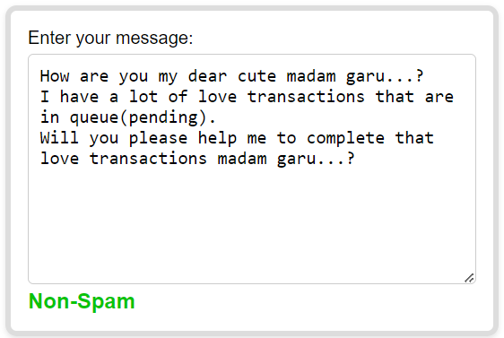

# Spam-Classifier-Machine-Learning
Intelligent Spam Filtering with Machine Learning

## Intelligent Spam Filtering: A Machine Learning Approach to Email/Message Security

**Introduction:**

In today's digital age, overflowing inboxes are a common challenge. Spam emails/messages, ranging from unsolicited marketing messages to phishing attempts, can not only clutter your inbox but also pose security threats. This project aims to tackle this issue by developing a robust spam classifier using machine learning (ML) techniques.

**Project Objectives:**

* **Build a highly accurate spam classifier:** Utilize machine learning algorithms to automatically identify spam emails, significantly reducing unwanted messages in your inbox.
* **Enhance email security:** Protect users from potential phishing scams and other malicious content by effectively filtering out suspicious emails/messages.
* **Increase productivity:** Minimize the time spent sorting through spam by automating the detection process, allowing users to focus on important messages.

* **Examples**

| Example Spam Message | Example Non-Spam Message |
|---|---|
|  |  |

**Machine Learning Approach:**

* **Data Collection & Preprocessing:** Gather a comprehensive dataset of labeled messages/emails (spam and non-spam) that will be used to train the ML model. Data cleaning and feature extraction techniques will be applied to ensure optimal model performance.
* **Algorithm Selection & Training:** Explore and implement various ML algorithms, such as Naive Bayes, Support Vector Machines (SVM), or Random Forests, to identify the most effective approach for accurate spam classification. Training the model involves feeding the prepared data into the chosen algorithm, allowing it to learn the patterns that differentiate spam from legitimate emails.
* In this project, I used **Naive Bayes** algorithm.
* **Evaluation & Refinement:** Evaluate the trained model's performance using metrics like accuracy, precision, and recall. Based on the results, iterate and refine the model by adjusting parameters, exploring alternative algorithms, or fine-tuning the data preprocessing steps.

**Benefits and Applications:**

* **Improved inbox management:** Spend less time sorting through spam and focus on what matters most in your inbox.
* **Enhanced security:** Protect yourself from phishing scams and other malicious content by automatically filtering out suspicious emails/messages.
* **Scalability and Adaptability:** Machine learning models can continuously adapt to evolving spam trends, maintaining long-term effectiveness.
* **Real-world Applications:** Integrate the developed classifier into email clients or web applications for individual and organizational use.

**Beyond the Code:**

* **Understanding Spam Patterns:** This project will provide insights into the tactics used by spammers, aiding in developing strategies for safer email practices.
* **Future Advancements:** Explore potential areas of improvement, such as incorporating natural language processing (NLP) techniques or real-time filtering capabilities for further enhancing the model's sophistication./emai

**Conclusion:**

This project leverages the power of machine learning to develop a cutting-edge spam classifier. By automating spam detection, this project offers a valuable tool for a more efficient, secure, and user-friendly email experience.

**Note** : Feel free to plan a journey through the code (.ipynb) [file is in the repo].
